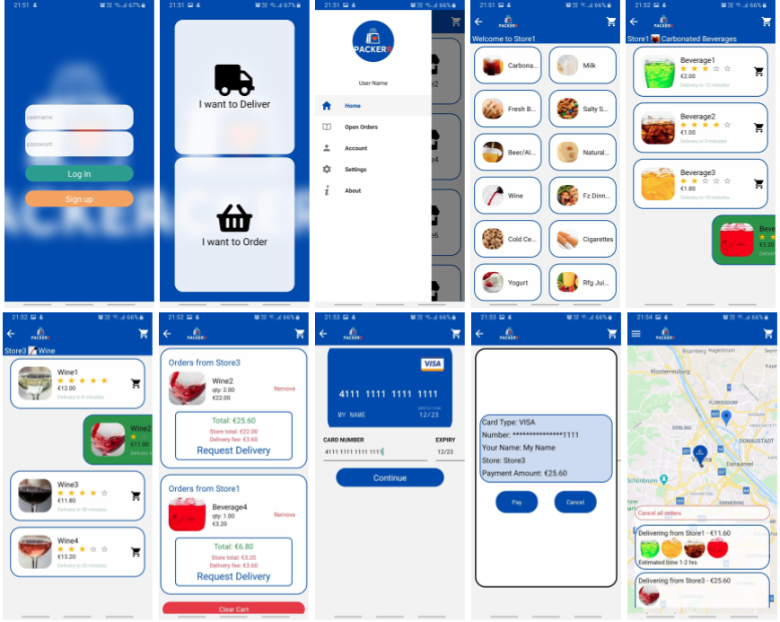

The purpose of this application is to provide a nice user interface for online grocery shopping. 

Demo #1

# notes for development
* make sure to create "local.properties" (DO NOT STAGE THIS FILE FOR VERSION CONTROL) file under "android/" folder and put the following line in it:
google.map.key = YOUR GOOGLE API KEY

* Make sure you have the api key available for ios devices too. 

